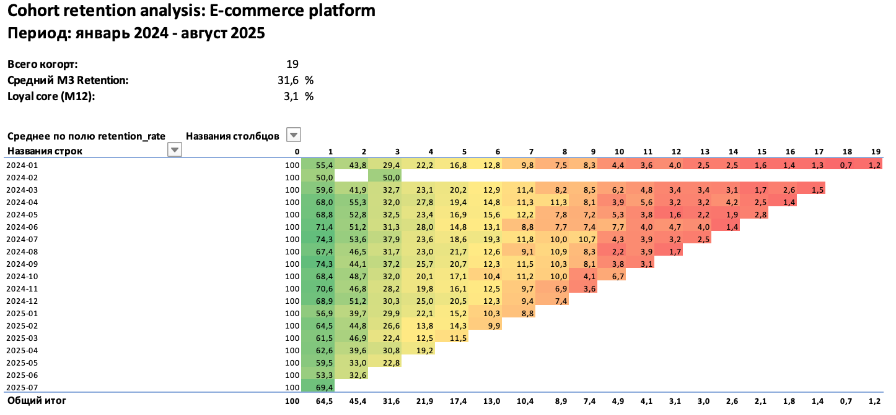
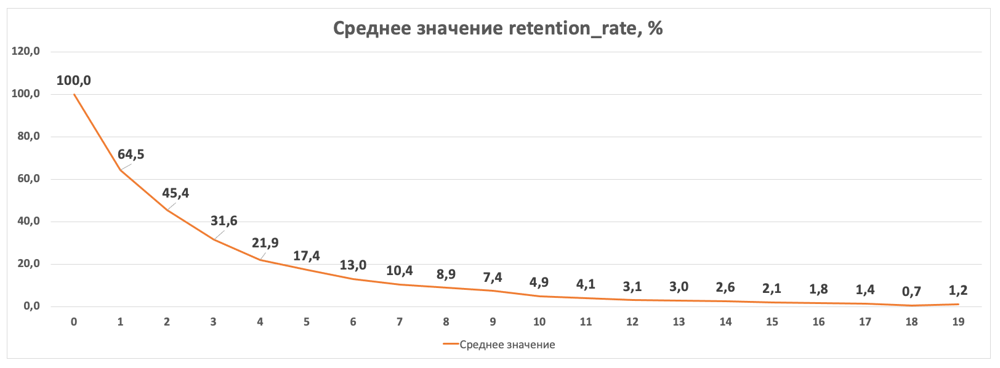

# Cohort Retention Analysis: E-commerce Platform

## ОПИСАНИЕ ПРОЕКТА
End-to-end когортный анализ удержания пользователей e-commerce платформы за период **январь 2024 — август 2025**

**Бизнес-задача:** Понять, насколько хорошо компания удерживает клиентов после первой покупки, выявить паттерны оттока и дать рекомендации по улучшению retention

---

## ТЕХНОЛОГИЧЕСКИЙ СТЕК
- **Python** (pandas, numpy, matplotlib, seaborn) — генерация, очистка и подготовка данных
- **MySQL** — хранение данных, SQL-запросы с CTE и оконными функциями
- **Excel** — построение heatmap с условным форматированием
- **Git/GitHub** — версионирование и портфолио

---

## СТРУКТУРА ПРОЕКТА
├── data/
│   ├── raw/                    # Сырые CSV-файлы
│   │   └── ecommerce_transactions.csv
│   └── clean/                  # Очищенные CSV-файлы
│       └── ecommerce.csv
│
├── reports/                    # Отчёты и результаты анализа
│   ├── data_quality.csv        	# Отчёт о качестве данных
│
├── scripts/                    # Python-скрипты
│   ├── generate_data.py        	# Генерация сырых данных
│   ├── clean_data.py        	# Очистка, графики
│   └── load_to_db.py        	# Загрузка данных в MySQL
│
├── sql/
│   └── sql_code.sql               	# SQL-код когортного анализа
│
├── img/                     # Скриншоты дашборда
├── requirements.txt            
└── README.md


---

## РЕЗУЛЬТАТЫ АНАЛИЗА
### Дашборд когортного анализа



### Ключевые метрики
| Метрика | Значение |
|---------|----------|
| Всего когорт | 19 |
| Средний M3 Retention | 31.6% |
| Loyal Core (M12) | 3.1% |

---

## КЛЮЧЕВЫЕ ИНСАЙТЫ
### 1. Основной отток происходит в первые 3 месяца
- **Month 1:** 64.5% пользователей возвращаются
- **Month 3:** 31.6% (потеряли почти 70% от исходной когорты)
- **Month 6:** 13.0%
- **Month 12:** 3.1%

**Вывод:** Критическая точка вмешательства — первые 90 дней после первой покупки

---

### 2. Стабильность когорт
Когорты с середины 2024 года (2024-07 — 2024-09) показывают **слегка лучшее удержание** на M3 (37-38%) по сравнению с началом года (29-32%)

**Гипотеза:** Возможно, в середине 2024 были внедрены улучшения в онбординг или продукте

---

### 3. Лояльное ядро
Через 12 месяцев остаётся **около 3% пользователей** от исходной когорты. Это "супер-лояльные" клиенты с максимальным LTV

---

##  РЕКОМЕНДАЦИИ 
### 1. Улучшить онбординг 
**Проблема:** 70% пользователей уходят в первые 3 месяца

**Решение:**
- Внедрить welcome-серию из 5 писем в первые 14 дней
- Добавить персонализированные рекомендации на основе первой покупки
- Предложить скидку 10% на вторую покупку в течение 30 дней

**Ожидаемый эффект:** Увеличение M3-retention с 31.6% до 40% 

---

### 2. Запустить программу лояльности 
**Проблема:** После 6 месяцев retention падает до 13%

**Решение:**
- Накопительная система баллов 
- Статусы "Silver/Gold/Platinum" с эксклюзивными предложениями
- Реферальная программа: "Приведи друга — получи 500 баллов"

**Ожидаемый эффект:** Увеличение M6-retention с 13% до 20%

---

### 3. Сегментировать коммуникации 
**Проблема:** Одноразовые клиенты (купили 1 раз и ушли) составляют около 30%

**Решение:**
- Сегмент "One-time buyers": отправить через 60 дней письмо "Мы скучаем" с персональным предложением
- Сегмент "Active buyers" (2+ покупки): предлагать cross-sell смежных категорий
- Сегмент "Loyal core" (6+ месяцев): VIP-предложения и ранний доступ к новинкам

---

## МЕТОДОЛОГИЯ
### Как считался Retention Rate
1. **Определение когорты:** Для каждого пользователя нашли месяц первой покупки (`MIN(transaction_date)`)
2. **Расчёт месяца жизни:** Использовали функцию MySQL `PERIOD_DIFF` для определения разницы в месяцах между транзакцией и первой покупкой
3. **Подсчёт активных пользователей:** `COUNT(DISTINCT user_id)` для каждой когорты и месяца жизни
4. **Расчёт процента:** `(active_users / cohort_size * 100.0)`

### SQL-запрос
```SQL
WITH users_all_cohorta AS (
	SELECT user_id,
		MIN(DATE_FORMAT(transaction_date, '%Y-%m')) AS month_cohorta, 
        MIN(transaction_date) AS first_cohorta_date
	FROM ecommerce
    GROUP BY user_id
),
cohorta_activity AS (
	SELECT uac.month_cohorta,
		PERIOD_DIFF(
        DATE_FORMAT(t.transaction_date, '%Y%m'),
        DATE_FORMAT(uac.first_cohorta_date, '%Y%m')
        ) AS cohort_index,
        COUNT(distinct t.user_id) AS active_users
	FROM ecommerce t
    JOIN users_all_cohorta uac ON t.user_id = uac.user_id 
    GROUP BY uac.month_cohorta,
		PERIOD_DIFF(
			DATE_FORMAT(t.transaction_date, '%Y%m'),
			DATE_FORMAT(uac.first_cohorta_date, '%Y%m')
			)
),
cohorta_sizes AS (
	SELECT month_cohorta,
		COUNT(DISTINCT user_id) AS cohorta_size
	FROM users_all_cohorta
    GROUP BY month_cohorta
)
SELECT 
	ca.month_cohorta,
    ca.cohort_index,
    cs.cohorta_size,
    ca.active_users,
    ROUND((ca.active_users/cs.cohorta_size * 100.0), 2) AS retention_rate
FROM cohorta_activity ca
JOIN cohorta_sizes cs ON ca.month_cohorta = cs.month_cohorta
ORDER BY ca.month_cohorta ASC, ca.cohort_index ASC

